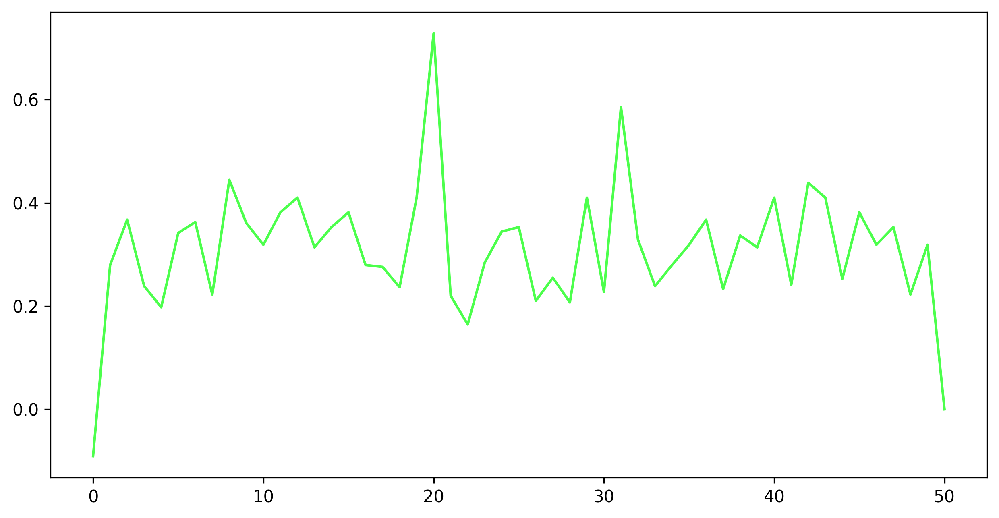
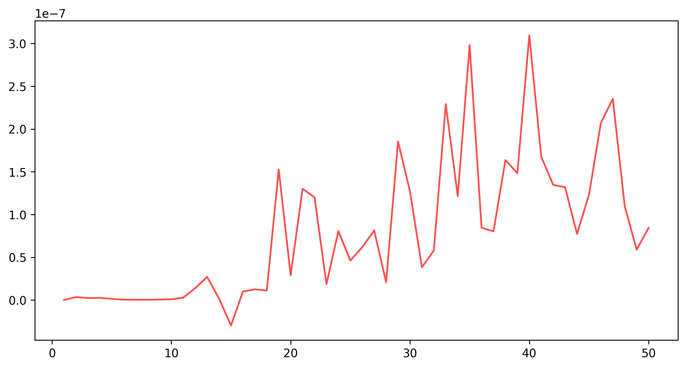
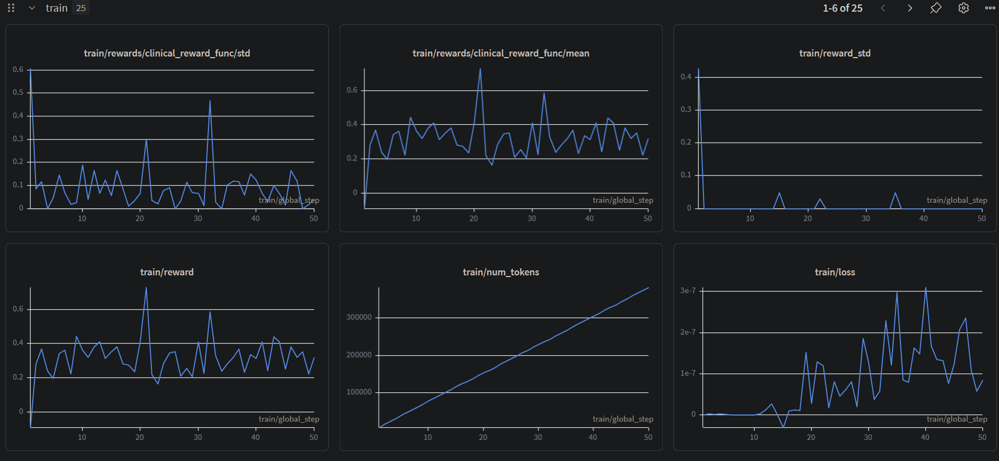

# Hospital Triage and Scheduling System

🚀 **[Play with the Environment on Hugging Face Spaces!](https://huggingface.co/spaces/HotaroOreki-art/hospital_triage)**
🎥 **[Watch our <2 Min Pitch Presentation Here](https://youtube.com/...)** *(Replace this link with your YouTube video!)*

## 🧠 Our Journey: Smashing the "Sparse Reward Wall"

When we first set out to build this autonomous medical triage agent, we immediately hit a massive roadblock known in Reinforcement Learning as the **"Sparse Reward Wall"**. 

Because the OpenEnv Hospital Triage API requires strictly formatted Pydantic JSON actions (e.g., `{"command": "BookAppointment", "patient_id": "..."}`), our untrained base model (`Qwen2.5-7B-Instruct`) couldn't generate a single valid response. Every single step returned a score of `0.0`. The GRPO algorithm was completely blind—it had no gradient signal to learn from.

To solve this, we engineered a **Two-Phase Curriculum RL Pipeline** using **Unsloth** and **Hugging Face TRL (GRPO)**:

### Phase 1: Bootstrap Syntax Training
We temporarily disconnected the agent from the hospital environment and replaced the reward function with a custom "Bootstrap" shaper. Instead of evaluating medical logic, we gave the agent partial credit (`+0.2`) just for outputting a curly bracket `{`, and (`+0.3`) for using the correct keys like `"command"`. Within **just 50 steps**, the GRPO algorithm aggressively steered the model into outputting flawless JSON arrays. The model learned how to "speak" the API.

### Phase 2: Clinical Triage Training
Once the agent could reliably generate valid JSON, we reconnected it to the live OpenEnv Engine. Now, the agent generated actions, the engine stepped forward in time, and the agent received a penalty/reward strictly between `0.01` and `0.99`. The reward was calculated dynamically based on wait-time metrics, ER capacity preservation, and medical safety. 

### Final Results
We ran Phase 2 on a free Google Colab T4 GPU. Our custom `train_grpo.py` script natively hooks into Weights & Biases and generates local matplotlib plots. Here is the evidence of our agent successfully learning to optimize triage safety!

#### Reward Progression
You can literally watch the model discover the medical logic. The baseline reward starts low as the agent makes dangerous scheduling mistakes, but the GRPO algorithm quickly forces the reward curve upward as the agent learns to prioritize critical chest-pain patients.


#### Training Loss


#### Weights & Biases Dashboard


### Try the Training Script Yourself!
Want to reproduce our RL run? We made it incredibly easy.
1. Open Google Colab with a T4 GPU.
2. Paste the contents of `train_grpo.py` into a cell and hit play! 
The script automatically clones this repo, installs the OpenEnv environment globally, configures `Qwen2.5-7B-Instruct` for 4-bit Unsloth tuning, mounts your Google Drive, and seamlessly runs the GRPO loop.

---

## Benchmark Details

This OpenEnv benchmark simulates a realistic outpatient triage desk where an agent must make safe scheduling decisions under staffing and room constraints. The environment is fully deterministic, exposes typed Pydantic action and observation models, and scores agent behavior with dense trajectory rewards kept strictly inside `(0.0, 1.0)`.

## Real-World Motivation

Hospital front desks and triage coordinators constantly balance urgency, doctor specialty coverage, limited rooms, and schedule disruptions. A useful reinforcement learning benchmark in this domain should reward safe early decisions, expose the operational context an assistant would actually see, and penalize dangerous sequencing errors such as delaying a critical patient with chest pain.

On a personal level, the project was partly inspired by the emotional reality shown in hospital dramas such as HBO's *The Pitt*: patients often experience uncertainty, long waits, and very little visibility into what happens next. This benchmark focuses on whether AI systems can reduce some of that operational stress through safer triage, scheduling, escalation, and communication support.

The real-world feasibility for this kind of system is grounded in existing healthcare research:
- [AHRQ: Machine Learning to Improve Patient Triage in the Emergency Department](https://digital.ahrq.gov/program-overview/research-stories/machine-learning-improve-patient-triage-emergency-department) describes EHR-integrated triage decision support aimed at improving identification of critical illness, admission risk, and fast-track eligibility.
- [Machine learning methods applied to triage in emergency services: A systematic review](https://www.sciencedirect.com/science/article/pii/S1755599X21001476) summarizes evidence that ML can support triage by predicting severity, hospitalization, and critical care needs.
- [Predict, then schedule: Prescriptive analytics approach for machine learning-enabled sequential clinical scheduling](https://www.sciencedirect.com/science/article/pii/S0360835222003357) shows how ML and optimization can be combined to improve clinical appointment scheduling under uncertainty.

This version also models four operational themes that matter in actual care settings:
- Human-in-the-loop confirmation for high-risk recommendations.
- Uncertainty escalation when the agent should defer to a clinician.
- Audit logging so every decision has an explanation trail.
- Wait-time and capacity pressure so the benchmark captures patient experience, not only correctness.

This benchmark now covers five practical workflows:
- Routine appointment booking.
- Multi-patient triage with one critical ER escalation.
- Specialty-safe rescheduling after a doctor calls in sick.
- Ambiguous walk-in clarification before specialty routing.
- Evening-surge coordination across ER, cardiology, neurology, and family medicine.

## Environment Interface

### Action Space

The environment uses a single strict Pydantic action model, `HospitalTriageAction`, with a required `command` field.

Supported commands:
- `BookAppointment`: requires `patient_id`, `doctor_id`, `room_id`, and `time_slot`.
- `SendToER`: requires `patient_id`.
- `RequestMoreInfo`: requires `patient_id` and `question`.
- `EscalateToClinician`: requires `patient_id` and `question`.
- `ConfirmRecommendation`: requires `recommendation_id`.

Example:

```python
HospitalTriageAction(
    command="BookAppointment",
    patient_id="p-routine-1",
    doctor_id="d-family-1",
    room_id="room-exam-1",
    time_slot="2026-04-07T09:00",
)
```

### Observation Space

`HospitalTriageObservation` includes:
- `patients`: symptoms, acuity, required specialty, current disposition, and any canceled appointment.
- `patients[].estimated_wait_minutes`, `uncertainty_level`, and `requires_clinician_review`.
- `doctors`: specialty, availability status, and currently open slots.
- `rooms`: room type and currently open slots.
- `scheduled_appointments`: appointments booked so far.
- `er_patient_ids`: patients already escalated to the ER.
- `pending_patient_ids`: unresolved patients.
- `pending_recommendations`: clinician-review items awaiting confirmation.
- `capacity`: waiting-room count, average wait, ER bed availability, clinic room availability, and pressure level.
- `audit_log`: explanation-rich event trail for agent, clinician, and system actions.
- `reward_breakdown`: structured grading details with component-level signals.
- `instruction`, `task_name`, `reward`, `done`, and metadata.

### Reward Model

Rewards are deterministic and always kept strictly within `(0.0, 1.0)`.

Each task exposes partial credit throughout the trajectory:
- Task 1 rewards correct booking plus wait-time relief and decision logging.
- Task 2 rewards addressing the critical patient first, using clinician confirmation for the risky recommendation, and then scheduling the stable patients.
- Task 3 rewards specialty-correct rescheduling, prioritizing urgent patients earlier, and controlling cumulative wait pressure.
- Task 4 rewards requesting more information before routing an ambiguous urgent walk-in, then clearing the remaining backlog.
- Task 5 rewards handling a septic patient first, preserving ER capacity, and coordinating an evening surge safely.

Dangerous behavior is explicitly penalized:
- In Task 2, any first action that ignores the critical chest-pain patient ends the episode at the minimum score of `0.01`.
- In Task 5, any first action that ignores the septic patient ends the episode at the minimum score of `0.01`.

## Tasks

### Task 1: Easy

Goal: book a routine check-up with an available doctor while clearing waiting-room pressure.

Expected policy behavior:
- Identify the routine patient.
- Choose the available family medicine doctor.
- Use the valid room and time slot.

### Task 2: Medium

Goal: triage three patients, prioritizing a critical chest-pain patient to the ER and scheduling the others.

Expected policy behavior:
- Escalate the critical patient for clinician confirmation first.
- Confirm the recommendation and send the critical patient to the ER.
- Schedule the orthopedic patient with orthopedics.
- Schedule the sore-throat patient with family medicine.

### Task 3: Hard

Goal: reschedule four patients after a doctor calls in sick, matching each patient to the correct specialty without double-booking doctors or rooms while limiting waiting pressure.

Expected policy behavior:
- Read the canceled appointments in the observation.
- Assign each patient to the correct specialist.
- Prioritize the urgent patients earlier.
- Avoid slot collisions across doctors and rooms.

### Task 4: Hard

Goal: clarify an ambiguous abdominal-pain walk-in before routing them, then clear the remaining specialty backlog.

Expected policy behavior:
- Request more information for the high-uncertainty abdominal case first.
- Route the clarified patient to gastroenterology instead of reflexively using the ER.
- Schedule the endocrinology and dermatology patients into their correct same-day slots.

### Task 5: Hard

Goal: manage an evening surge by escalating a septic patient, preserving limited ER capacity, and routing the rest of the queue safely.

Expected policy behavior:
- Escalate the septic patient for clinician confirmation first.
- Confirm the ER recommendation.
- Request more information for the ambiguous arrhythmia walk-in before booking cardiology.
- Schedule the neurology and family medicine patients without leaving backlog unresolved.

## Running Locally

### Install

```bash
pip install -e .
```

Or with `uv`:

```bash
uv sync
```

### Start the OpenEnv Server

```bash
python -m server.app
```

When the web interface is enabled, open `/web` and use the `Task Selector` tab to load any of the five benchmark scenarios before stepping through them in the standard playground.

Two interaction tips for demos:
- Every task starts at `reward = 0.01` on reset because no progress has been made yet and the benchmark keeps scores strictly inside `(0.0, 1.0)`.
- After loading a task in `Task Selector`, switch to `Playground` and click `Step` with a valid action. Do not click `Playground Reset` unless you want to return to the default Task 1 scenario.

### Quick Direct Test

```python
from server.hospital_triage_environment import HospitalTriageEnvironment
from models import HospitalTriageAction

env = HospitalTriageEnvironment()
obs = env.reset(task_name="task_2_multi_patient_triage")
obs = env.step(
    HospitalTriageAction(
        command="EscalateToClinician",
        patient_id="p-critical-1",
        question="Please confirm the safest next step for this high-risk case.",
    )
)
obs = env.step(HospitalTriageAction(command="ConfirmRecommendation", recommendation_id="rec-critical-1"))
print(obs.reward, obs.reward_breakdown)
```

## Docker

Build:

```bash
docker build -t hospital-triage-openenv -f server/Dockerfile .
```

Run:

```bash
docker run --rm -p 8000:8000 hospital-triage-openenv
```

## Baseline Inference Script

The repository includes `inference.py` in the project root. It uses the standard `openai` Python client and reads these environment variables:
- `API_BASE_URL` with default `https://router.huggingface.co/v1`
- `MODEL_NAME` with default `Qwen/Qwen2.5-72B-Instruct`
- `HF_TOKEN`
- `OPENAI_API_KEY` is also accepted as a local-development fallback, but the official hackathon flow should use `HF_TOKEN`.

Run it like this:

```bash
HF_TOKEN=... python inference.py
```

The script emits logs in this exact format:

```text
[START] task=<task_name> env=<benchmark> model=<model_name>
[STEP] step=<n> action=<action_str> reward=<0.01> done=<true|false> error=<msg|null>
[END] success=<true|false> steps=<n> score=<score> rewards=<r1,r2,...,rn>
```

## Baseline Scores

Measured with the included `inference.py` baseline runner:
- Task 1: `0.99`
- Task 2: `0.99`
- Task 3: `0.99`
- Task 4: `0.99`
- Task 5: `0.99`

The script runs in well under the 20 minute inference limit on the current 5-task benchmark, and each task has a deterministic maximum score of `0.99` with partial-credit trajectory signals down to `0.01`.

## Project Structure

```text
hospital_triage/
|- __init__.py
|- client.py
|- inference.py
|- models.py
|- openenv.yaml
|- pyproject.toml
|- README.md
`- server/
   |- app.py
   |- Dockerfile
   |- hospital_triage_environment.py
   `- requirements.txt
```
